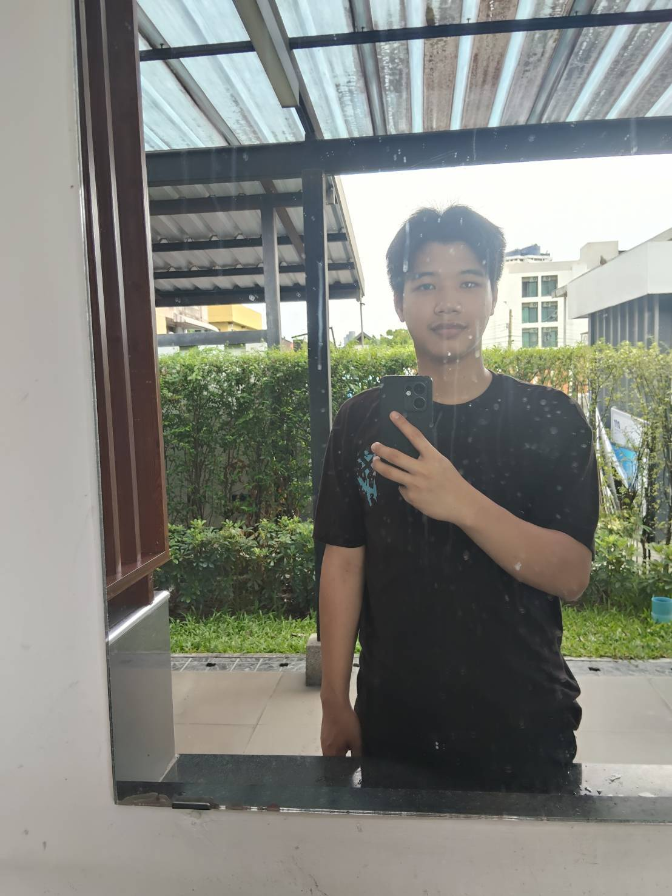

    ผู้สัมภาษณ์ : PANNATHON BUNPRASAN (Pao) 036
    ผู้ให้สัมภาษณ์ : Woranasak Kaitphichetchuen (Achi) 052

1.🎶 ช่วงนี้เป็นยังไงบ้าง 😗:
รู้สึกเหนื่อยเพราะต้องปรับตัวเข้ากับมหาลัยใหม่ เเละสังคมใหม่ๆเเต่ก็รู้สึกสนุกด้วย🫠

2.🤾 ช่วงนี้มีงานอดิเรกที่ชอบทำไหม 📖:
ไม่รู้สิน่าจะเป็นเล่นกับฟังเพลงเพราะมันผ่อนคลายดี👾

3.🏫 รีวิวการเรียนให้ฟังหน่อย เป็นอย่างไรบ้าง:
เอาตามตรงก็ไม่ค่อยเข้าใจบางวิชาเพราะศัพท์เฉพาะมันเยอะ 🤷‍♂️

4.🪀 มีอะไรที่ยังไม่เคยทำ แต่อยากลองทำบ้าง  🤺⛷️:
อยากไปเที่ยวญี่ปุ่น เพราะเคยเห็นคลิปคนไปเที่ยวญี่ปุ่นเเล้วอยากลอง 🤖👾

5..⌛ ในอนาคตอยากลองใช้ขีวิตแบบไหน 🕰️:
ทำงานไปเรื่อยๆเก็บเงินเเละซื้อความสุขให้ตังเอง ☺️😗

[IG : ] https://www.instagram.com/o_4xh1?igsh=eGF6MGVnaHh6ZHRp&igsi=eGF6MGVnaHh6ZHRp

