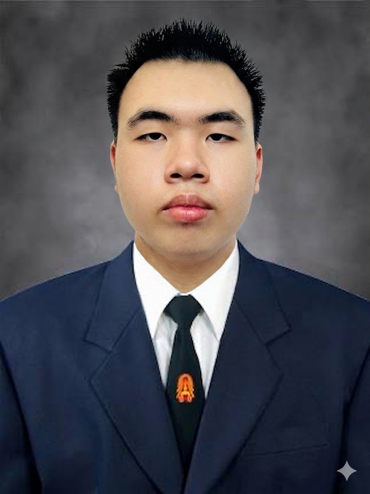
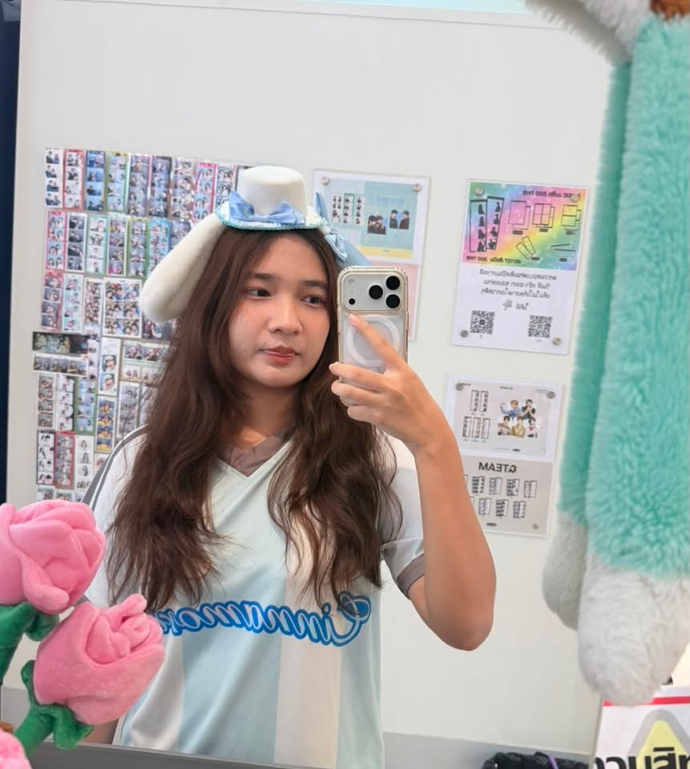

    ผู้สัมภาษณ์ : Batcha Palalay (NumNim) 033
    ผู้ให้สัมภาษณ์ : Jaruwat Rubngam (Bank) 006

## 😑 1. ช่วงนี้เป็นยังไงบ้าง
 สบายดีไม่มีอะไรพิเศษทุกอย่างปกติดี ติดแค่หาร้านอาหารไม่ค่อยได้ ทำให้ต้องกินของเดิมๆบ่อยกว่าปกติ

## 2. ช่วงนี้มีงานอดิเรกที่ชอบทำไหม 👾
 ปั้นโมเดล,วาดรูป และ เล่นเกม และ อ่านหนังสือหรือทบทวนตอนใกล้สอบ นอกจากนั้นก็ไม่ได้ทำอะไรแล้ว

## 3. รีวิวการเรียนให้ฟังหน่อย เป็นอย่างไรบ้าง 😘
 เรียนก็โอเคมียากบ้างง่ายบ้างปะปนกันไป ถึงแม้จะรู้สึกว่ามีแต่ยาก แต่ก็ไม่ได้ยากเกินไป แค่บางทีไม่เข้าใจว่าต้องทำยังไง แต่โดยรวมก็ยังพอเอาตัวรอดได้อยู่

## 4. มีอะไรที่ยังไม่เคยทำ แต่อยากลองทำบ้าง 🎮
 อยากลองสร้างเกม แต่ไม่เคยทำ อยากลองทำการตูนร์ เอนิเมะชั่น 2D และ 3D กำลังวางแผนอยู่ว่าช่วงปิดเทอมจะลองทำดูไหม

## 🧊 5. ในอนาคตอยากลองใช้ชีวิตแบบไหน
 อยากมีชีวิตเรียบง่ายแต่มั่นคง และ ไม่มีเรื่องกวนใจ ได้ทำงานที่ตรงกับความต้องการ

## Contact : [ FaceBook ](https://www.facebook.com/profile.php?id=100041777152444)

 
ผู้สัมภาษณ์ : Boonyada Kongklaiphiphop (Chomphoo) 034
ผู้ให้สัมภาษณ์ : Chutikan Sangmongkol (Pai) 013  

## 🌱 1. ช่วงนี้เป็นยังไงบ้าง
ช่วงนี้กำลังอยู่ในช่วงปรับตัวกับการใช้ชีวิตข้างนอกและการใช้ชีวิตในมหาวิทยาลัย เพราะก่อนหน้านี้อยู่บ้านช่วงปิดเทอม ตั้งแต่ประมาณเดือนมีนาคม และเพิ่งเริ่มใช้ชีวิตมหาวิทยาลัยจริง ๆ ช่วงเดือนกรกฎาคม ทำให้ต้องปรับตัวทั้งเรื่อง การเรียนและสังคม 

ได้เจอเพื่อนใหม่และสังคมใหม่ ๆ ซึ่งก็มีทั้งช่วงที่สนุก และช่วงที่เหนื่อยเพราะเรียนหนักและงานเยอะ แต่โดยรวมถือว่าโอเคและเริ่มปรับตัวได้ดีขึ้น 😊

 ## 2. ช่วงนี้มีงานอดิเรกที่ชอบทำไหม 📖
ช่วงนี้ชอบ เขียน Planner มาก ๆ เป็นคนที่ชอบจดและต้องจดว่าวันนี้ต้องทำอะไรบ้าง รวมถึงจดว่าวันนี้เป็นอย่างไรและรู้สึกยังไงบ้าง

การเขียน Planner ช่วยให้สามารถ วางแผนชีวิตในแต่ละวันและจัดการเวลาได้ง่ายขึ้น ทำให้รู้ว่าตัวเองต้องทำอะไรและมีอะไรที่ต้องจัดการบ้าง ✏️

 ## 3. รีวิวการเรียนให้ฟังหน่อย เป็นอย่างไรบ้าง 🎓
การเรียนช่วงนี้มีทั้ง วิชาที่ง่ายและยาก บางวิชาเรียนแล้วรู้สึกสนุกและชอบมาก ส่วนบางวิชาก็ค่อนข้างยากและต้องใช้ความคิดเยอะ
 แต่ถึงบางวิชาจะยากก็รู้สึกว่าเป็น ความท้าทายที่ดี และทำให้ได้ลองพัฒนาตัวเองมากขึ้น 💪🏻

 ## 4. มีอะไรที่ยังไม่เคยทำ แต่อยากลองทำบ้าง 🌷
ในอนาคตถ้ามีงานทำ มีเงินเดือนและมีเงินเก็บแล้ว อยากเปิดร้านขายดอกไม้ ที่มีบรรยากาศเหมือนอยู่ต่างประเทศ เน้นธรรมชาติและดอกไม้ที่ปลูกเองอยากให้เวลาจัดดอกไม้สามารถไป 
ตัดดอกไม้ที่ปลูกไว้แล้วนำมาจัดเป็นช่อสวยๆ รู้สึกว่าเป็นบรรยากาศที่ดีและมีมู้ดมาก 🌸

## 🌿 5. ในอนาคตอยากลองใช้ชีวิตแบบไหน
อยากใช้ชีวิตแบบ สบาย ๆ ไม่ต้องคิดหรือกดดันตัวเองมาก มีเวลาให้ตัวเอง ได้ทำสิ่งที่ชอบ และได้อยู่กับคนที่ทำให้รู้สึกสบายใจ
อยากใช้ชีวิตไปเรื่อย ๆ แบบมีความสุข ไม่ต้องกดดันตัวเองมากจนเกินไป และได้ใช้ชีวิตในแบบที่ตัวเองต้องการ 🫶🏻

## [ IG : ] https://www.instagram.com/unipaiii/?hl=th

