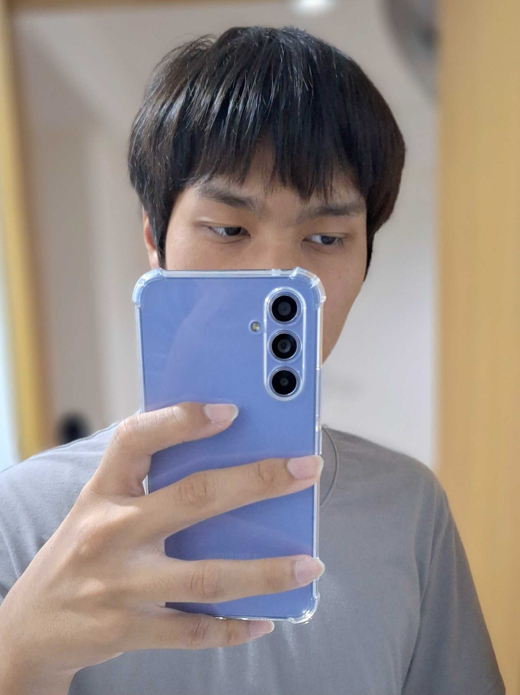

    ผู้สัมภาษณ์ : Jaruwat Rubngam (Bank) 006
    ผู้ให้สัมภาษณ์ : Natawat Sudchuen (Nanfah) 015

## 1.🎶 ช่วงนี้เป็นยังไงบ้าง 😗:
รู้สึกไม่ค่อยมีอะไรดีๆ และไม่เคยมีไม่เคยมีอะไรดีๆ ในชีวิต จนถึงตอนนี้ยังไม่ค่อยมีเพื่อนเท่าไหร่
แล้วก็มาอยู่หอทำให้ค่อนข้างที่จะตัวคนเดียว แต่ก็ปรับตัวได้รวดเร็ว ไม่ค่อยมีปัญหาเท่าไหร่ อยู่ตัวคนเดียวได้ยาวๆ🫠

## 2.🤾 ช่วงนี้มีงานอดิเรกที่ชอบทำไหม 📖:
ชอบเล่นเกมไม่ต่างจากคนอื่น แม้ช่วงนี้จะเล่นน้อยลงมากแต่ก็ยังคงเล่นอยู่ ทั้งยังฟังเพลงในช่วงเวลาต่างๆ รวมถึงช่วงที่เล่นเกมก็ด้วยเช่นกัน แล้วยังชอบดูอนิเมะ และอ่านมังงะเป็นชีวิตจิตใจ👾

## 3.🏫 รีวิวการเรียนให้ฟังหน่อย เป็นอย่างไรบ้าง:
ชอบเล่นเกมไม่ต่างจากคนอื่น แม้ช่วงนี้จะเล่นน้อยลงมากแต่ก็ยังคงเล่นอยู่ ทั้งยังฟังเพลงในช่วงเวลาต่างๆ รวมถึงช่วงที่เล่นเกมก็ด้วยเช่นกัน แล้วยังชอบดูอนิเมะ และอ่านมังงะเป็นชีวิตจิตใจ 🤷‍♂️

## 4.🪀 มีอะไรที่ยังไม่เคยทำ แต่อยากลองทำบ้าง  🤺⛷️:
ถ้าเป็นตอนนี้ละก็ อยากลองทำอนิเมชั่น 3D เล่นๆ เพราะตั้งแต่เด็กก็ชอบดูพวกแฟนอนิเมชั่นทั้ง 2D และ 3D ของเกมและอนิเมะมาตลอด ก็เลยอยากลองเอาตัวละครจากเกมมาทำแฟนอนิเมชั่นเล่นๆ แต่ก็ยังไม่เคยทำ ยังไม่มีประสบการณ์เลย 🤖👽👾

## 5..⌛ ในอนาคตอยากลองใช้ขีวิตแบบไหน 🕰️:
สงบสุข สบาย เรียบง่าย มีเงินใช้ตลอด และมีความสุข แล้วก็อยากมีอิสระด้วย อยากมีเวลาว่างที่จะได้ทำในสิ่งที่อยากทำในแต่ละช่วงเวลา  รวมถึงได้ใช้เวลาร่วมกับคนที่สำคัญในชีวิตให้ไม่เสียใจภายหลัง☺️😗

## [IG : ] https://www.instagram.com/firmamentalnan/

