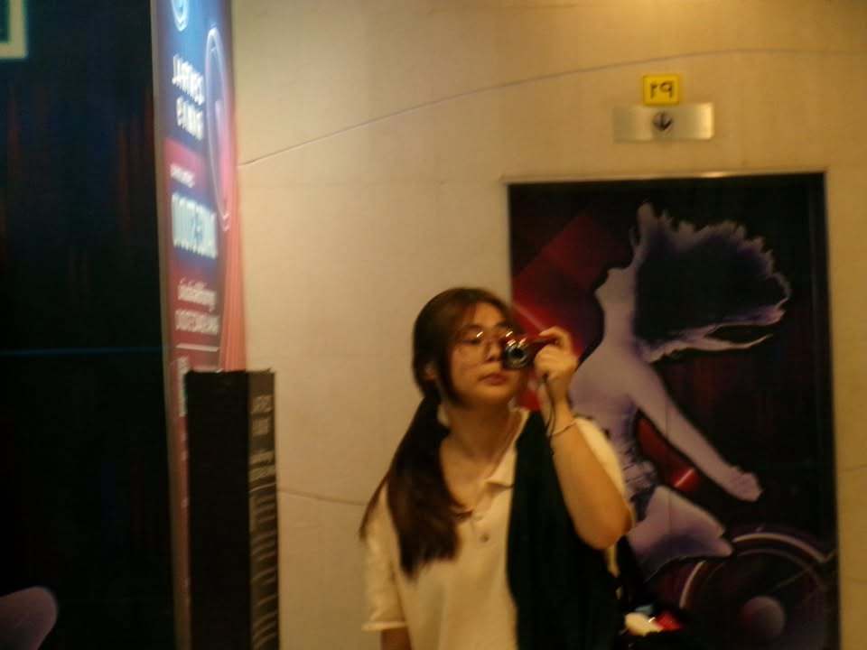

    ผู้สัมภาษณ์ : Chutikan Sangmongkol (Pai) 013 🐱
    ผู้ให้สัมภาษณ์ : Boonyada Kongklaiphiphop (Chomphoo) 034 🐻

## 1. ช่วงนี้เป็นยังไงบ้าง เล่าให้ฟังหน่อย 🧐
🐻 : โดยรวมยังโอเค เพราะโรงเรียนเดิมเป็นโรงเรียนทางเลือก 
รูปแบบการเรียนค่อนข้างคล้ายกันเลยปรับตัวได้ง่ายและรวดเร็ว งานมีเยอะขึ้นกว่าตอน ม.ปลาย แต่ก็รู้สึกว่าเป็นฝึกการทักษะและช่วยให้ได้รู้ว่าเข้าใจเนื้อหามากน้อยแค่ไหน💖

## 2. ช่วงนี้มีงานอดิเรกที่ชอบทำไหม 🧸
🐻 : ชอบฟังเพลงเหมือนเดิมและชอบเปิดเพลงฟังตอนทำงานหรือเวลาว่าง เพราะรู้สึกสบายใจและช่วยลดความเครียดได้ บางครั้งใช้การฟังเพลงเป็นเหมือนการพักผ่อนเวลาคิดงานไม่ออก🎧

## 3. รีวิวการเรียนให้ฟังหน่อย เป็นอย่างไรบ้าง 📖
🐻 : ก่อนเข้ามาเรียนคิดว่าน่าจะเรียนไม่ทันและต้องพยายามมากกว่าคนอื่นๆ แต่พอได้เรียนจริงๆ มีทั้งเรื่องที่ยากและง่ายปนกัน ตอนนี้ผ่านมาแค่ 2 สัปดาห์ เลยคิดว่าน่าจะมีเรื่องที่ยากขึ้นอีก แต่โดยรวมยังเรียนได้ดี ถ้าไม่เข้าใจก็ถามเพื่อนหรืออาจารย์ ซึ่งอาจารย์ก็พร้อมช่วยอธิบายให้เข้าใจมากขึ้น💻

## 4. มีอะไรที่ยังไม่เคยทำ แต่อยากลองทำบ้าง 🤩
🐻 : ยังไม่เคยไปเที่ยวต่างประเทศหรือขึ้นเครื่องบินเลย แต่อยากลองไปเที่ยวกับเพื่อนหรือครอบครัวสักครั้ง ติดตรงที่กังวลเรื่องภาษาและกลัวสื่อสารกับคนต่างชาติไม่รู้เรื่อง แต่ถ้าในอนาคต ถ้ามีงานทำ มีเงินเก็บและมีโอกาส ก็อยากลองไปเที่ยวต่างประเทศดู✈️

## 5. ในอนาคตอยากลองใช้ขีวิตแบบไหน ✨
🐻 : อยากมีอิสระทางการเงิน สามารถใช้จ่ายในสิ่งที่อยากได้โดยไม่ต้องกังวลมาก เพราะเป็นคนใช้เงินค่อนข้างเก่ง เลยตั้งใจว่าในอนาคตอยากทำงาน หาเงิน และเก็บเงินให้ได้เยอะๆ เพื่อให้สามารถใช้จ่ายได้อย่างสบายใจและมีการวางแผนมากขึ้น💸

# Contact 🪄
### IG : https://www.instagram.com/cth.p9s

