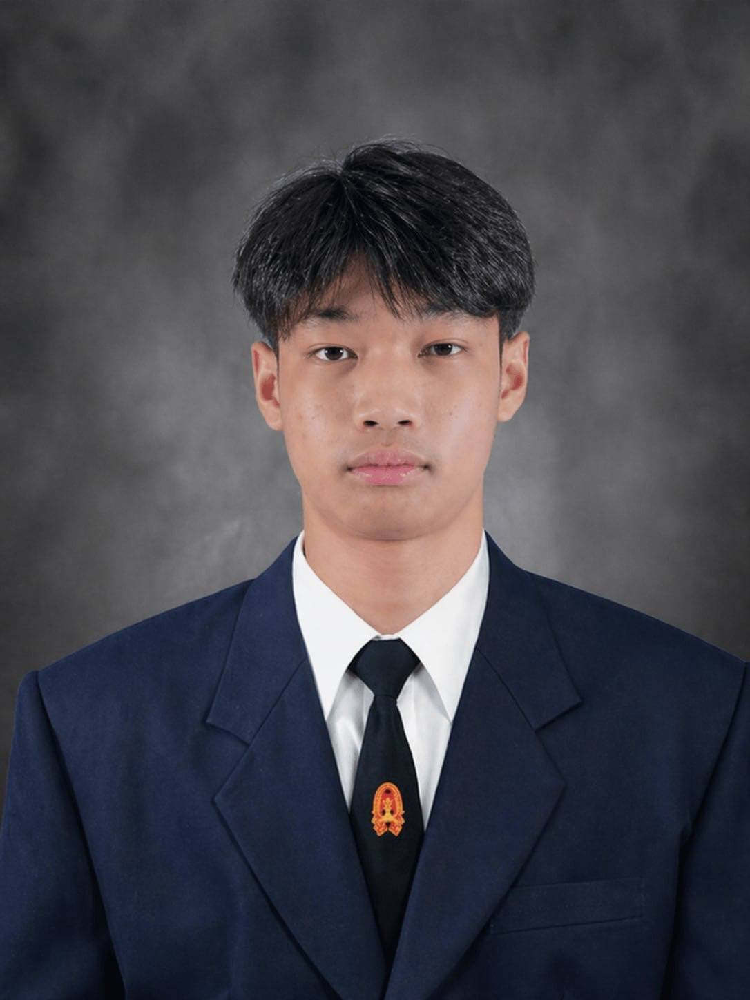

    ผู้สัมภาษณ์ : Woranasak Kaitphichetchuen (Achi) 052
    ผู้ให้สัมภาษณ์ : PANNATHON BUNPRASAN (Pao) 036

1.🎶 ช่วงนี้เป็นยังไงบ้าง 😗:
ช่วงนี้กำลังปรับตัวกับสภาพแวดล้อมใหม่ๆ ปรับตัวกับเพื่อนใหม่ๆ และ กำลังสนุกกับชีวิตตอนนี้ที่ได้เจอคนมากมายทั้งเพื่อนและรุ่นพี่ที่ทำกิจกรรมร่วมกัน🫠

2.🤾 ช่วงนี้มีงานอดิเรกที่ชอบทำไหม 📖:
ช่วงนี้ออกกำลังกายและไปเตะฟุตบอลบ่อยทั้งกับเพื่อนคณะอื่นๆและเพื่อนคณะตัวเอง เพราะอยากเล่นทีมมหาลัย👾

3.🏫 รีวิวการเรียนให้ฟังหน่อย เป็นอย่างไรบ้าง:
เป็นการเรียนที่ต้องโฟกัสมากๆและต้องทำความเข้าใจให้เร็วเพราะเนื้อหาค่อนข้างเยอะ 🤷‍♂️

4.🪀 มีอะไรที่ยังไม่เคยทำ แต่อยากลองทำบ้าง  🤺⛷️:
อยากไปเที่ยวต่างประเทศกับเพื่อน แต่รอทำงานมีเงินก่อน 🤖👾

5..⌛ ในอนาคตอยากลองใช้ขีวิตแบบไหน 🕰️:
ทอยากใช้ชีวิตแบบอิสระ ทำงานเสร็จแล้วมีแรงใช้ชีวิตต่อ ไปหมดแรงหลังทำงานเสร็จ ☺️😗

[IG : ] https://www.instagram.com/skelext?igsh=NWpycjdmZ3Y2YnZ1&igsi=NWpycjdmZ3Y2YnZ1

